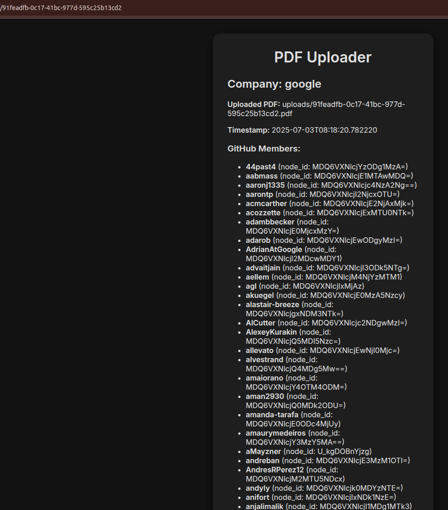

# Usage

This is the render website: https://assignment-m5gm.onrender.com/

It works, only to show the UI. I need to run huey_consumer in the background, which I cannot do on render without paying up (to run background workers, we need to pay). The huey_consumer is essential for non-blocking and queuing. I could have done `immediate=True` with huey and that would elimanate the need for the consumer, but that will mean no schelduling and log status. It depends on what is required honestly.

### For running locally (if you want to see the database files itself and the full functionality)

1. Install poetry

```sh
pip install poetry
```

2. Clone the repo

```sh
git clone https://github.com/pUrGe12/LT_assig
cd LT_assig
```

3. Install poetry dependencies

```sh
poetry install
```

5. Add your gemini API key in .env at root

```sh
echo "API_KEY:<your_key_here>" > .env
```

4. Run from main

```sh
poetry run python3 main.py
```

### For using on render

Visit: `https://assignment-m5gm.onrender.com/`

### What it does

1. Runs huey_consumer in the background
2. Queues all file uploads using huey and executes them via the consumer
3. Uses an sqlite database to save all the logs from the GitHub API
4. Gemini to extract the company github orgs from the pdf
5. Non-blocking, this means the user can enter multiple pdfs in succession, get the IDs for them
6. To check the logs, there are two ways

- Either do this locally and use sqlite3 to verify

```sh
cd LT_assig
sqlite3 .data/assignment.db

sqlite3 > .tables
sqlite3 > select * from github_results; 
```

- Or hit the endpoint `/<uuid>`. 

For now this only returns IF the scan is completed. This is not ideal but since huey process does tell me how much time has elasped and estimated time, this won't be hard to change and display the progress here. I can't do it right now because I am travelling.

This is how it looks like:



